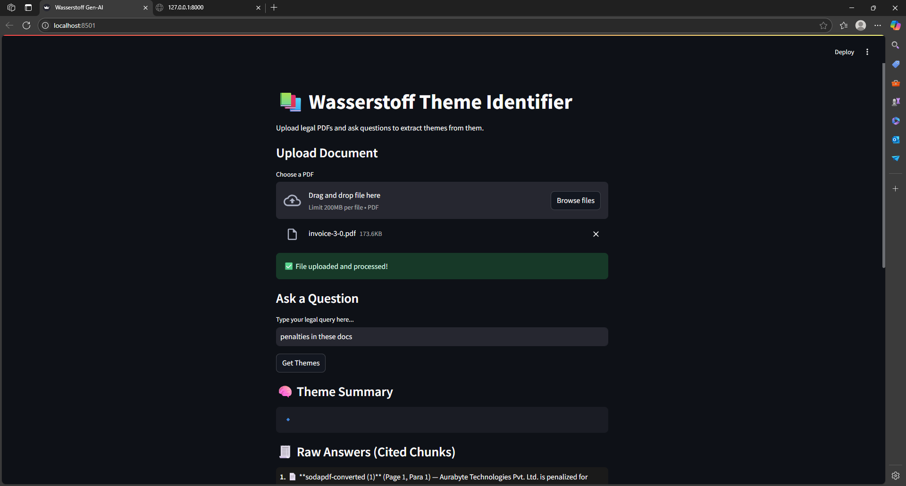

# 🧠 Wasserstoff Gen-AI Internship Task

This project extracts and summarizes legal themes from uploaded PDFs using OCR, embeddings, vector search (FAISS), and LLM-powered reasoning.

## 🚀 Features
- Upload scanned or native PDFs
- Extract text using OCR (Tesseract)
- Chunk, embed, and store in FAISS
- Ask natural language questions
- Get theme-based insights and citations
- Streamlit-based frontend

## 📦 Tech Stack
- FastAPI
- LangChain
- FAISS
- OpenAI / Ollama
- Tesseract OCR
- Streamlit

## 📸 Demo


## 🧪 Running Locally

1. Clone this repo
2. Create `.env` file with OpenAI key (optional)
3. Run backend:
   ```bash
   uvicorn app.main:app --reload
